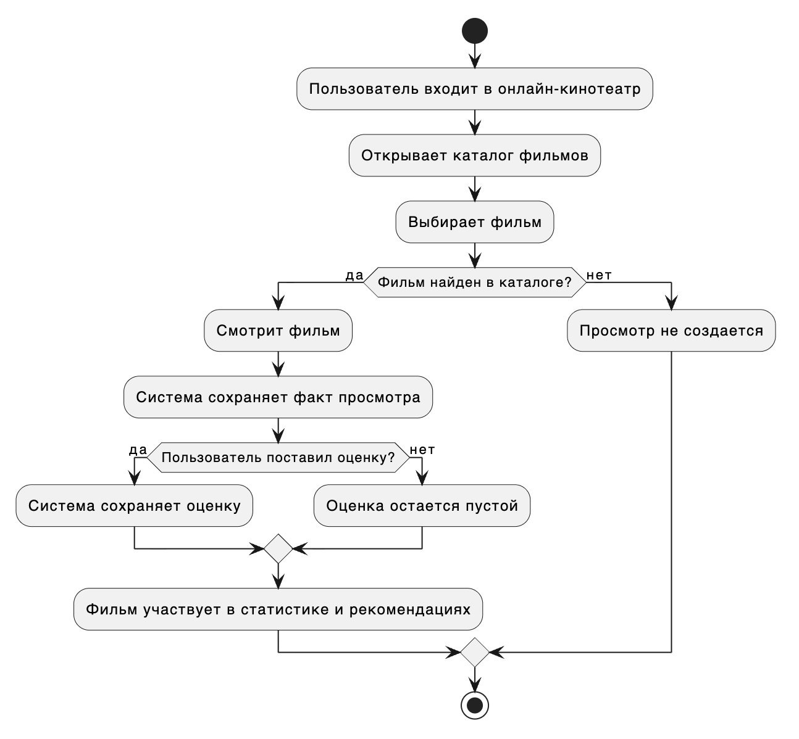
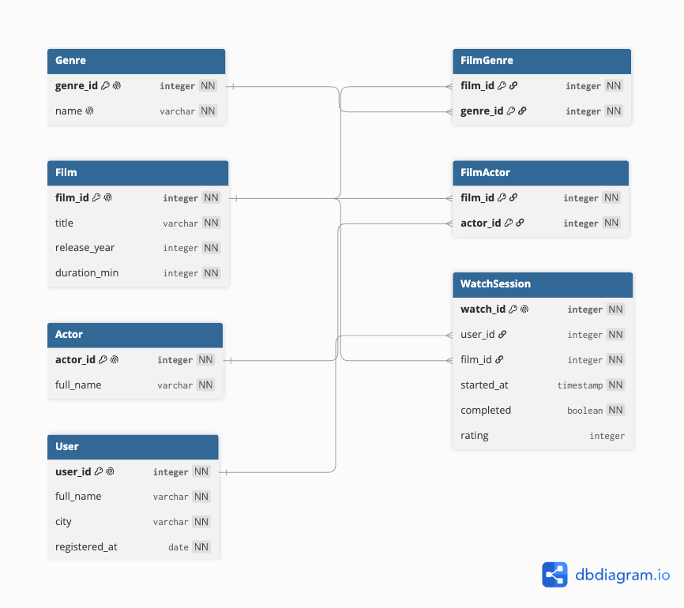
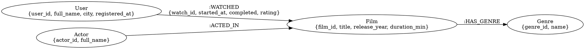

# Домашняя работа: реляционная и графовая базы данных

## Что было сделано

У меня уже был реализован подходящий под задание проект (online-cinema pipeline), поэтому и предметной областью я выбрала онлайн кинотеатр 

Я выделила основные сущности, описала правила и упрощения, сформулировала вопросы к данным, построила ER-модель и показала две реализации одной и той же модели:

* реляционная база данных: таблицы, связи, SQL-наполнение и запросы
* графовая база данных: LPG-модель, Cypher-наполнение и запросы

В конце я сравнила оба подхода и написала, где каждый из них удобнее использовать

## Предметная область

В качестве предметной области я выбрала онлайн-кинотеатр. В модели есть: 
* пользователи 
* фильмы
* жанры
* актеры
* факты просмотра фильмов

Онлайн-кинотеатр хранит каталог фильмов и фиксирует, кто какой фильм посмотрел. По этим данным можно смотреть историю просмотров, находить популярные жанры и делать простые рекомендации

### Сущности предметной области

* Пользователь (`User`) - человек, который зарегистрирован в онлайн-кинотеатре и смотрит фильмы
* Фильм (`Film`) - фильм из каталога онлайн-кинотеатра
* Жанр (`Genre`) - категория фильма, например драма, фантастика или комедия
* Актер (`Actor`) - актер, который снимался в фильме
* Просмотр (`WatchSession`) - факт просмотра фильма пользователем

### Атрибуты сущностей

* Пользователь: идентификатор, имя, город, дата регистрации
* Фильм: идентификатор, название, год выпуска, длительность в минутах
* Жанр: идентификатор, название
* Актер: идентификатор, имя
* Просмотр: идентификатор, пользователь, фильм, дата и время начала просмотра, статус завершения, оценка

### Правила в предметной области

* Один пользователь может смотреть много фильмов
* Один фильм могут смотреть разные пользователи
* Каждый просмотр относится к одному пользователю и одному фильму
* Фильм может относиться к нескольким жанрам
* Один жанр может быть у разных фильмов
* В одном фильме может быть несколько актеров
* Один актер может сниматься в разных фильмах
* У пользователя не должно быть двух одинаковых просмотров одного фильма с одним и тем же временем начала
* Оценка может быть пустой, если пользователь ее не поставил

### Упрощения модели предметной области

* Я не учитываю паузы, перемотки и повторные запуски внутри одного просмотра
* Я не рассматриваю оплату, подписки, промокоды и тарифы
* В модели нет режиссеров, стран производства, студий и возрастных ограничений
* Рекомендации строятся только по жанрам, актерам и общим просмотрам
* Считается, что каталог фильмов уже проверен

### Вопросы к предметной области

Я хочу получить из модели ответы на такие вопросы:

1. Какие фильмы смотрел пользователь с номером 101?
2. Какие жанры самые популярные по количеству просмотров?
3. Какие фильмы можно рекомендовать пользователю 101 на основе жанров уже просмотренных фильмов?
4. Какие актеры чаще всего встречаются в фильмах, которые смотрел пользователь 101?
5. Какие пары фильмов часто смотрят одни и те же пользователи?
6. Есть ли ошибочные дубли: два просмотра одного и того же фильма одним пользователем с одинаковым временем начала?

## Модель предметной области



Эта модель показывает основной сценарий: пользователь выбирает фильм, смотрит его, а система сохраняет просмотр. Потом эти данные можно использовать для статистики и рекомендаций

## Модель отношений между сущностями

ER-модель описана в DBML (в dbdiagram.io). Связи многие-ко-многим я вынесла в отдельные таблицы `FilmGenre` и `FilmActor`



## Реализация реляционной базы данных

Ниже приведено описание создание таблиц на SQL, его можно использовать в PostgreSQL или SQLite с небольшой адаптацией

```sql
CREATE TABLE users (
  user_id INTEGER PRIMARY KEY,
  full_name TEXT NOT NULL,
  city TEXT NOT NULL,
  registered_at DATE NOT NULL
);

CREATE TABLE films (
  film_id INTEGER PRIMARY KEY,
  title TEXT NOT NULL,
  release_year INTEGER NOT NULL,
  duration_min INTEGER NOT NULL
);

CREATE TABLE genres (
  genre_id INTEGER PRIMARY KEY,
  name TEXT NOT NULL UNIQUE
);

CREATE TABLE actors (
  actor_id INTEGER PRIMARY KEY,
  full_name TEXT NOT NULL
);

CREATE TABLE film_genres (
  film_id INTEGER NOT NULL,
  genre_id INTEGER NOT NULL,
  PRIMARY KEY (film_id, genre_id),
  FOREIGN KEY (film_id) REFERENCES films(film_id),
  FOREIGN KEY (genre_id) REFERENCES genres(genre_id)
);

CREATE TABLE film_actors (
  film_id INTEGER NOT NULL,
  actor_id INTEGER NOT NULL,
  PRIMARY KEY (film_id, actor_id),
  FOREIGN KEY (film_id) REFERENCES films(film_id),
  FOREIGN KEY (actor_id) REFERENCES actors(actor_id)
);

CREATE TABLE watch_sessions (
  watch_id INTEGER PRIMARY KEY,
  user_id INTEGER NOT NULL,
  film_id INTEGER NOT NULL,
  started_at TEXT NOT NULL,
  completed INTEGER NOT NULL,
  rating INTEGER,
  UNIQUE (user_id, film_id, started_at),
  FOREIGN KEY (user_id) REFERENCES users(user_id),
  FOREIGN KEY (film_id) REFERENCES films(film_id),
  CHECK (rating IS NULL OR rating BETWEEN 1 AND 10)
);
```

### Наполнение реляционной базы данных

```sql
INSERT INTO users (user_id, full_name, city, registered_at) VALUES
(101, 'Анна Смирнова', 'Москва', '2025-01-10'),
(102, 'Игорь Павлов', 'Самара', '2025-02-14'),
(103, 'Мария Кузнецова', 'Казань', '2025-02-20'),
(104, 'Дмитрий Орлов', 'Москва', '2025-03-01');

INSERT INTO films (film_id, title, release_year, duration_min) VALUES
(201, 'Космический рейс', 2021, 118),
(202, 'Городские истории', 2020, 104),
(203, 'Последний алгоритм', 2023, 126),
(204, 'Смешной отпуск', 2019, 96),
(205, 'Тихая гавань', 2022, 111),
(206, 'Петля времени', 2024, 122);

INSERT INTO genres (genre_id, name) VALUES
(301, 'фантастика'),
(302, 'драма'),
(303, 'комедия'),
(304, 'триллер');

INSERT INTO actors (actor_id, full_name) VALUES
(401, 'Алексей Волков'),
(402, 'Елена Морозова'),
(403, 'Павел Соколов'),
(404, 'Ольга Белова'),
(405, 'Никита Лебедев');

INSERT INTO film_genres (film_id, genre_id) VALUES
(201, 301),
(201, 302),
(202, 302),
(203, 301),
(203, 304),
(204, 303),
(205, 302),
(206, 301),
(206, 304);

INSERT INTO film_actors (film_id, actor_id) VALUES
(201, 401),
(201, 402),
(202, 402),
(202, 403),
(203, 401),
(203, 405),
(204, 403),
(204, 404),
(205, 402),
(205, 404),
(206, 401),
(206, 405);

INSERT INTO watch_sessions (watch_id, user_id, film_id, started_at, completed, rating) VALUES
(501, 101, 201, '2025-04-01 19:00:00', 1, 9),
(502, 101, 202, '2025-04-03 20:15:00', 1, 8),
(503, 101, 203, '2025-04-08 21:00:00', 1, 10),
(504, 102, 201, '2025-04-02 18:30:00', 1, 8),
(505, 102, 204, '2025-04-05 22:00:00', 1, 7),
(506, 102, 206, '2025-04-10 20:00:00', 1, 9),
(507, 103, 202, '2025-04-04 19:45:00', 1, 7),
(508, 103, 205, '2025-04-06 20:10:00', 1, 8),
(509, 103, 201, '2025-04-11 18:00:00', 1, 9),
(510, 104, 203, '2025-04-04 21:20:00', 1, 9),
(511, 104, 206, '2025-04-07 22:10:00', 1, 8),
(512, 104, 202, '2025-04-12 19:10:00', 1, 7);
```

## Запросы к реляционной базе данных

### 1. Какие фильмы смотрел пользователь 101?

```sql
SELECT f.title, ws.started_at, ws.rating
FROM watch_sessions ws
JOIN films f ON f.film_id = ws.film_id
WHERE ws.user_id = 101
ORDER BY ws.started_at;
```

Ответ:

| title | started_at | rating |
| --- | --- | --- |
| Космический рейс | 2025-04-01 19:00:00 | 9 |
| Городские истории | 2025-04-03 20:15:00 | 8 |
| Последний алгоритм | 2025-04-08 21:00:00 | 10 |

### 2. Какие жанры самые популярные по количеству просмотров?

```sql
SELECT g.name, COUNT(*) AS watch_count
FROM watch_sessions ws
JOIN film_genres fg ON fg.film_id = ws.film_id
JOIN genres g ON g.genre_id = fg.genre_id
GROUP BY g.genre_id, g.name
ORDER BY watch_count DESC, g.name;
```

Ответ:

| name | watch_count |
| --- | ---: |
| драма | 7 |
| фантастика | 7 |
| триллер | 4 |
| комедия | 1 |

### 3. Какие фильмы рекомендовать пользователю 101 на основе жанров уже просмотренных фильмов?

```sql
SELECT DISTINCT f.title
FROM films f
JOIN film_genres fg ON fg.film_id = f.film_id
WHERE fg.genre_id IN (
  SELECT fg2.genre_id
  FROM watch_sessions ws2
  JOIN film_genres fg2 ON fg2.film_id = ws2.film_id
  WHERE ws2.user_id = 101
)
AND f.film_id NOT IN (
  SELECT ws3.film_id
  FROM watch_sessions ws3
  WHERE ws3.user_id = 101
)
ORDER BY f.title;
```

Ответ: `Петля времени`, `Тихая гавань`

### 4. Какие актеры чаще всего встречаются в фильмах, которые смотрел пользователь 101?

```sql
SELECT a.full_name, COUNT(*) AS films_watched_with_actor
FROM watch_sessions ws
JOIN film_actors fa ON fa.film_id = ws.film_id
JOIN actors a ON a.actor_id = fa.actor_id
WHERE ws.user_id = 101
GROUP BY a.actor_id, a.full_name
ORDER BY films_watched_with_actor DESC, a.full_name;
```

Ответ:

| full_name | films_watched_with_actor |
| --- | ---: |
| Алексей Волков | 2 |
| Елена Морозова | 2 |
| Никита Лебедев | 1 |
| Павел Соколов | 1 |

### 5. Какие пары фильмов часто смотрят одни и те же пользователи?

```sql
SELECT f1.title AS film_1, f2.title AS film_2, COUNT(*) AS common_users
FROM watch_sessions ws1
JOIN watch_sessions ws2
  ON ws1.user_id = ws2.user_id
 AND ws1.film_id < ws2.film_id
JOIN films f1 ON f1.film_id = ws1.film_id
JOIN films f2 ON f2.film_id = ws2.film_id
GROUP BY f1.title, f2.title
HAVING COUNT(*) >= 2
ORDER BY common_users DESC, film_1, film_2;
```

Ответ:

| film_1 | film_2 | common_users |
| --- | --- | ---: |
| Городские истории | Последний алгоритм | 2 |
| Космический рейс | Городские истории | 2 |

### 6. Есть ли ошибочные дубли просмотров?

```sql
SELECT user_id, film_id, started_at, COUNT(*) AS duplicate_count
FROM watch_sessions
GROUP BY user_id, film_id, started_at
HAVING COUNT(*) > 1;
```

Ответ: строк нет, ошибочные дубли не найдены. Дополнительно в таблице есть ограничение `UNIQUE (user_id, film_id, started_at)`, поэтому такие дубли не должны попадать в базу

## Графовая модель данных

Для графовой базы данных я использовала модель LPG (Labeled Property Graph). В ней сущности становятся узлами, а связи между ними становятся отношениями

### LPG в Graphviz DOT



В графовой модели просмотр можно хранить не отдельным узлом, а связью `:WATCHED` между пользователем и фильмом. Это выглядит естественно, потому что просмотр и есть связь между двумя объектами

## Реализация графовой базы данных

### Создание ограничений и индексов

```cypher
CREATE CONSTRAINT user_id_unique IF NOT EXISTS
FOR (u:User) REQUIRE u.user_id IS UNIQUE;

CREATE CONSTRAINT film_id_unique IF NOT EXISTS
FOR (f:Film) REQUIRE f.film_id IS UNIQUE;

CREATE CONSTRAINT genre_id_unique IF NOT EXISTS
FOR (g:Genre) REQUIRE g.genre_id IS UNIQUE;

CREATE CONSTRAINT actor_id_unique IF NOT EXISTS
FOR (a:Actor) REQUIRE a.actor_id IS UNIQUE;
```

### Создание узлов

```cypher
MERGE (:User {user_id: 101, full_name: 'Анна Смирнова', city: 'Москва', registered_at: date('2025-01-10')})
MERGE (:User {user_id: 102, full_name: 'Игорь Павлов', city: 'Самара', registered_at: date('2025-02-14')})
MERGE (:User {user_id: 103, full_name: 'Мария Кузнецова', city: 'Казань', registered_at: date('2025-02-20')})
MERGE (:User {user_id: 104, full_name: 'Дмитрий Орлов', city: 'Москва', registered_at: date('2025-03-01')});

MERGE (:Film {film_id: 201, title: 'Космический рейс', release_year: 2021, duration_min: 118})
MERGE (:Film {film_id: 202, title: 'Городские истории', release_year: 2020, duration_min: 104})
MERGE (:Film {film_id: 203, title: 'Последний алгоритм', release_year: 2023, duration_min: 126})
MERGE (:Film {film_id: 204, title: 'Смешной отпуск', release_year: 2019, duration_min: 96})
MERGE (:Film {film_id: 205, title: 'Тихая гавань', release_year: 2022, duration_min: 111})
MERGE (:Film {film_id: 206, title: 'Петля времени', release_year: 2024, duration_min: 122});

MERGE (:Genre {genre_id: 301, name: 'фантастика'})
MERGE (:Genre {genre_id: 302, name: 'драма'})
MERGE (:Genre {genre_id: 303, name: 'комедия'})
MERGE (:Genre {genre_id: 304, name: 'триллер'});

MERGE (:Actor {actor_id: 401, full_name: 'Алексей Волков'})
MERGE (:Actor {actor_id: 402, full_name: 'Елена Морозова'})
MERGE (:Actor {actor_id: 403, full_name: 'Павел Соколов'})
MERGE (:Actor {actor_id: 404, full_name: 'Ольга Белова'})
MERGE (:Actor {actor_id: 405, full_name: 'Никита Лебедев'});
```

### Создание связей

```cypher
MATCH (f201:Film {film_id: 201}), (f202:Film {film_id: 202}), (f203:Film {film_id: 203}),
      (f204:Film {film_id: 204}), (f205:Film {film_id: 205}), (f206:Film {film_id: 206}),
      (g301:Genre {genre_id: 301}), (g302:Genre {genre_id: 302}),
      (g303:Genre {genre_id: 303}), (g304:Genre {genre_id: 304})
MERGE (f201)-[:HAS_GENRE]->(g301)
MERGE (f201)-[:HAS_GENRE]->(g302)
MERGE (f202)-[:HAS_GENRE]->(g302)
MERGE (f203)-[:HAS_GENRE]->(g301)
MERGE (f203)-[:HAS_GENRE]->(g304)
MERGE (f204)-[:HAS_GENRE]->(g303)
MERGE (f205)-[:HAS_GENRE]->(g302)
MERGE (f206)-[:HAS_GENRE]->(g301)
MERGE (f206)-[:HAS_GENRE]->(g304);

MATCH (a401:Actor {actor_id: 401}), (a402:Actor {actor_id: 402}), (a403:Actor {actor_id: 403}),
      (a404:Actor {actor_id: 404}), (a405:Actor {actor_id: 405}),
      (f201:Film {film_id: 201}), (f202:Film {film_id: 202}), (f203:Film {film_id: 203}),
      (f204:Film {film_id: 204}), (f205:Film {film_id: 205}), (f206:Film {film_id: 206})
MERGE (a401)-[:ACTED_IN]->(f201)
MERGE (a402)-[:ACTED_IN]->(f201)
MERGE (a402)-[:ACTED_IN]->(f202)
MERGE (a403)-[:ACTED_IN]->(f202)
MERGE (a401)-[:ACTED_IN]->(f203)
MERGE (a405)-[:ACTED_IN]->(f203)
MERGE (a403)-[:ACTED_IN]->(f204)
MERGE (a404)-[:ACTED_IN]->(f204)
MERGE (a402)-[:ACTED_IN]->(f205)
MERGE (a404)-[:ACTED_IN]->(f205)
MERGE (a401)-[:ACTED_IN]->(f206)
MERGE (a405)-[:ACTED_IN]->(f206);

MATCH (u101:User {user_id: 101}), (u102:User {user_id: 102}), (u103:User {user_id: 103}), (u104:User {user_id: 104}),
      (f201:Film {film_id: 201}), (f202:Film {film_id: 202}), (f203:Film {film_id: 203}),
      (f204:Film {film_id: 204}), (f205:Film {film_id: 205}), (f206:Film {film_id: 206})
MERGE (u101)-[:WATCHED {watch_id: 501, started_at: datetime('2025-04-01T19:00:00'), completed: true, rating: 9}]->(f201)
MERGE (u101)-[:WATCHED {watch_id: 502, started_at: datetime('2025-04-03T20:15:00'), completed: true, rating: 8}]->(f202)
MERGE (u101)-[:WATCHED {watch_id: 503, started_at: datetime('2025-04-08T21:00:00'), completed: true, rating: 10}]->(f203)
MERGE (u102)-[:WATCHED {watch_id: 504, started_at: datetime('2025-04-02T18:30:00'), completed: true, rating: 8}]->(f201)
MERGE (u102)-[:WATCHED {watch_id: 505, started_at: datetime('2025-04-05T22:00:00'), completed: true, rating: 7}]->(f204)
MERGE (u102)-[:WATCHED {watch_id: 506, started_at: datetime('2025-04-10T20:00:00'), completed: true, rating: 9}]->(f206)
MERGE (u103)-[:WATCHED {watch_id: 507, started_at: datetime('2025-04-04T19:45:00'), completed: true, rating: 7}]->(f202)
MERGE (u103)-[:WATCHED {watch_id: 508, started_at: datetime('2025-04-06T20:10:00'), completed: true, rating: 8}]->(f205)
MERGE (u103)-[:WATCHED {watch_id: 509, started_at: datetime('2025-04-11T18:00:00'), completed: true, rating: 9}]->(f201)
MERGE (u104)-[:WATCHED {watch_id: 510, started_at: datetime('2025-04-04T21:20:00'), completed: true, rating: 9}]->(f203)
MERGE (u104)-[:WATCHED {watch_id: 511, started_at: datetime('2025-04-07T22:10:00'), completed: true, rating: 8}]->(f206)
MERGE (u104)-[:WATCHED {watch_id: 512, started_at: datetime('2025-04-12T19:10:00'), completed: true, rating: 7}]->(f202);
```

## Запросы к графовой базе данных

### 1. Какие фильмы смотрел пользователь 101?

```cypher
MATCH (:User {user_id: 101})-[w:WATCHED]->(f:Film)
RETURN f.title AS title, w.started_at AS started_at, w.rating AS rating
ORDER BY w.started_at;
```

Ответ: `Космический рейс`, `Городские истории`, `Последний алгоритм`

### 2. Какие жанры самые популярные по количеству просмотров?

```cypher
MATCH (:User)-[:WATCHED]->(:Film)-[:HAS_GENRE]->(g:Genre)
RETURN g.name AS genre, count(*) AS watch_count
ORDER BY watch_count DESC, genre;
```

Ответ: фантастика - 7, драма - 7, триллер - 4, комедия - 1

### 3. Какие фильмы рекомендовать пользователю 101 на основе жанров уже просмотренных фильмов?

```cypher
MATCH (u:User {user_id: 101})-[:WATCHED]->(:Film)-[:HAS_GENRE]->(g:Genre)<-[:HAS_GENRE]-(rec:Film)
WHERE NOT (u)-[:WATCHED]->(rec)
RETURN DISTINCT rec.title AS recommendation
ORDER BY recommendation;
```

Ответ: `Петля времени`, `Тихая гавань`

### 4. Какие актеры чаще всего встречаются в фильмах, которые смотрел пользователь 101?

```cypher
MATCH (:User {user_id: 101})-[:WATCHED]->(f:Film)<-[:ACTED_IN]-(a:Actor)
RETURN a.full_name AS actor, count(f) AS films_watched_with_actor
ORDER BY films_watched_with_actor DESC, actor;
```

Ответ: Алексей Волков - 2, Елена Морозова - 2, Никита Лебедев - 1, Павел Соколов - 1

### 5. Какие пары фильмов часто смотрят одни и те же пользователи?

```cypher
MATCH (u:User)-[:WATCHED]->(f1:Film)
MATCH (u)-[:WATCHED]->(f2:Film)
WHERE f1.film_id < f2.film_id
WITH f1, f2, count(u) AS common_users
WHERE common_users >= 2
RETURN f1.title AS film_1, f2.title AS film_2, common_users
ORDER BY common_users DESC, film_1, film_2;
```

Ответ:

| film_1 | film_2 | common_users |
| --- | --- | ---: |
| Городские истории | Последний алгоритм | 2 |
| Космический рейс | Городские истории | 2 |

### 6. Есть ли ошибочные дубли просмотров?

```cypher
MATCH (u:User)-[w:WATCHED]->(f:Film)
WITH u.user_id AS user_id, f.film_id AS film_id, w.started_at AS started_at, count(w) AS duplicate_count
WHERE duplicate_count > 1
RETURN user_id, film_id, started_at, duplicate_count;
```

Ответ: строк нет, ошибочные дубли не найдены

## Сравнение реляционной и графовой реализации

Реляционная модель хорошо подходит для строгого хранения данных. В ней удобно задавать первичные и внешние ключи, уникальность и ограничения, например, можно запретить просмотр без пользователя или фильма

Графовая модель удобнее там, где важны связи: пользователь смотрел фильм, фильм имеет жанр, актер снимался в фильме, другой пользователь смотрел похожие фильмы. Такие запросы в Cypher получаются короче и читаются проще

Для обычной статистики подходят обе модели. В SQL это делается через `JOIN` и `GROUP BY`, а в графовой базе - через обход связей

Для контроля данных реляционная модель выглядит надежнее. В графовой базе тоже есть ограничения, но часть проверок удобнее делать отдельными запросами или на уровне приложения

## Выводы

Я сделала вывод, что одну и ту же предметную область можно реализовать и в реляционной, и в графовой базе данных, но они удобны для разных задач

Реляционная база данных лучше подходит для основной системы онлайн-кинотеатра: каталог, пользователи, просмотры, ограничения и обычная отчетность

Графовая база данных лучше подходит для анализа связей и рекомендаций: похожие фильмы, общие актеры, общие жанры и пользователи со схожими просмотрами

В реальности можно использовать сразу оба подхода: реляционную базу использовала бы как основное хранилище, а графовую - для рекомендаций и анализа связей
